<div align="center">

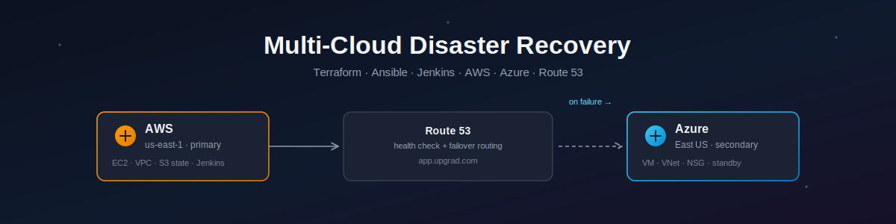

### Automated failover between AWS and Azure using Terraform, Ansible, Jenkins & Route 53

[](https://www.terraform.io/)
[](https://aws.amazon.com/)
[](https://azure.microsoft.com/)
[](https://www.ansible.com/)
[](https://www.jenkins.io/)
[](https://nginx.org/)
[](https://aws.amazon.com/route53/)
[](https://ubuntu.com/)

*A fully automated, Infrastructure-as-Code multi-cloud DR solution — AWS as primary, Azure as hot standby, with DNS-level automatic failover.*

</div>

---

## 📖 Overview

This project provisions and operates a **two-cloud disaster recovery architecture**, entirely through code:

- **AWS (`us-east-1`)** hosts the **primary** application stack.
- **Azure (`East US`)** hosts a **standby/DR** replica of the same stack.
- **AWS Route 53** continuously health-checks the primary and automatically flips DNS to the Azure secondary the moment AWS becomes unreachable — no manual intervention required.
- **Terraform** provisions all infrastructure on both clouds from one shared remote state backend.
- **Ansible** configures Nginx identically on both servers in a single idempotent playbook run.
- **Jenkins** builds a CI/CD pipeline that pulls from this repo and redeploys the app to both clouds on every run.

The goal: prove that if the AWS side goes down completely, traffic keeps flowing — automatically — from a completely independent cloud provider.

---

## 🏗️ Architecture

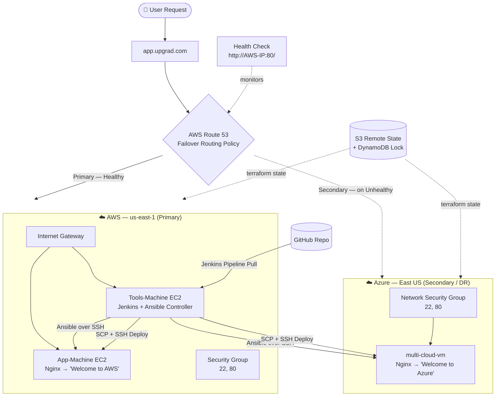

**Failover in plain terms:** Route 53 pings the AWS App-Machine on port 80 every interval. As soon as that check reports *Unhealthy* (e.g., the instance is stopped), Route 53 stops answering DNS queries with the AWS IP and starts answering with the Azure IP instead — verified live in this project by physically stopping the AWS instance and re-querying DNS (see [Screenshots](#-screenshots--proof-of-work)).

---

## ✨ Key Features

| Capability | How it's achieved |
|---|---|
| 🧱 Infrastructure as Code | Two independent Terraform root modules (`aws/`, `azure/`), each with reusable child modules for networking, compute, and security |
| 🔒 Safe concurrent state | Shared **S3** backend + **DynamoDB** lock table, separate state keys per cloud |
| ⚙️ Idempotent configuration | Single **Ansible** playbook targets both `[aws]` and `[azure]` inventory groups |
| 🚀 Continuous deployment | **Jenkins** declarative pipeline — Checkout → Deploy to AWS → Deploy to Azure |
| 🔁 Automatic DR failover | **Route 53** failover routing policy + active health check on the primary |
| 💰 Cost-aware design | Documented hourly/monthly cost breakdown with an optimization callout |

---

## 🧰 Tech Stack

| Tool | Version Used | Purpose |
|---|---|---|
|  | v1.14.6 | Provisioning AWS + Azure infrastructure |
|  | v2.34.4 | AWS authentication & scripting |
|  | v2.84.0 | Azure authentication & scripting |
|  | core 2.20.3 | Configuration management (Nginx install/config) |
|  | Declarative Pipeline | CI/CD automation |
|  | latest (apt) | Web server on both cloud endpoints |
|  | — | DNS failover routing + health checks |
|  | LTS | OS for all EC2 instances & the Azure VM |

---

## 📁 Repository Structure

```
Multi-Cloud-Disaster-Recovery-Project/
├── Jenkinsfile                  # 3-stage declarative CI/CD pipeline
├── .gitignore                   # Excludes *.pem, *.tfstate, .terraform/
│
├── aws/                         # AWS root Terraform module
│   ├── main.tf                  # Provider, S3 backend, key pair, module calls
│   ├── variables.tf             # Region, AMI, CIDR blocks, instance_type
│   ├── outputs.tf                # app_public_ip, tools_public_ip, vpc_id
│   ├── terraform.tfvars
│   └── modules/
│       ├── vpc/                 # VPC, 4 subnets, IGW, NAT Gateway, route tables
│       ├── ec2/                 # App-Machine, Tools-Machine, Elastic IPs
│       └── security_group/      # Inbound 22 + 80, outbound all
│
├── azure/                       # Azure root Terraform module
│   ├── main.tf                  # azurerm provider, S3 backend, module calls
│   ├── variables.tf
│   ├── outputs.tf                # vm_public_ip, vm_private_key_path
│   ├── terraform.tfvars
│   └── modules/
│       ├── vnet/                 # Resource Group, VNet, Subnet
│       ├── vm/                   # Linux VM, NIC, Public IP, SSH key generation
│       └── security_group/       # NSG: inbound 22 + 80
│
└── ansible/
    ├── inventory.ini             # [aws] App-Machine, [azure] multi-cloud-vm
    ├── playbook.yml               # Nginx install + HTML deploy, both clouds
    └── files/
        ├── index-aws.html         # "Welcome to AWS" — primary page
        └── index-azure.html       # "Welcome to Azure" — DR page
```

> Sensitive values (SSH private keys, credentials) are **never committed**. SSH keys are generated at `terraform apply` time via the `tls_private_key` resource, and Jenkins injects credentials at runtime through its credentials store — both are excluded via `.gitignore`.

---

## 🚀 Getting Started

### Prerequisites

- AWS account with programmatic access (`aws configure`)
- Azure account (`az login`)
- [Terraform](https://developer.hashicorp.com/terraform/install) ≥ 1.14
- [Ansible](https://docs.ansible.com/ansible/latest/installation_guide/index.html) core ≥ 2.20
- Jenkins (or use the included `Jenkinsfile` on any Jenkins controller)
- An S3 bucket + DynamoDB table for remote state (create these once, before first `init`)

### 1. Clone the repository

```bash
git clone https://github.com/ARIESH-git/Multi-Cloud-Disaster-Recovery-Project.git
cd Multi-Cloud-Disaster-Recovery-Project
```

### 2. Provision AWS infrastructure

```bash
cd aws
terraform init
terraform plan
terraform apply
```

### 3. Provision Azure infrastructure

```bash
cd ../azure
terraform init
terraform plan
terraform apply
```

### 4. Configure both servers with Ansible

```bash
cd ../ansible
# Update inventory.ini with the IPs from the terraform outputs above
ansible-playbook -i inventory.ini playbook.yml
```

### 5. Set up the Jenkins pipeline

1. Create a new **Pipeline** job in Jenkins named `multi-cloud-deploy`.
2. Point **Pipeline script from SCM** at this repo, branch `*/main`, script path `Jenkinsfile`.
3. Add SSH credentials in Jenkins: `aws-ssh-key`, `azure-ssh-key`, plus `github-credentials`.
4. Run the build — it will SCP the HTML files and restart Nginx on both hosts.

### 6. Configure Route 53 failover

1. Create a public hosted zone for your domain.
2. Add a health check pointed at `http://<AWS_APP_IP>:80/`.
3. Create two **Failover** A records for your subdomain: **Primary** → AWS IP (with the health check attached), **Secondary** → Azure IP.

### 7. Test the failover

```bash
# Stop the AWS App-Machine instance (from the AWS Console or CLI)
aws ec2 stop-instances --instance-ids <app-machine-instance-id>

# Wait for the health check to mark it Unhealthy, then test DNS resolution
dig app.<your-domain>.com
# or use the Route 53 "Test record" tool in the console
```

---

## 📸 Screenshots — Proof of Work

<table>
<tr>
<td width="50%">

**Toolchain confirmed on the Tools-Machine**
<br/>Terraform v1.14.6 and AWS CLI v2.34.4 verified, `aws configure` set for `us-east-1`.

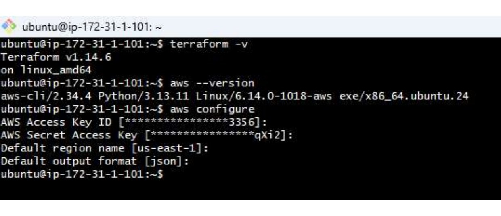

</td>
<td width="50%">

**AWS infrastructure provisioned**
<br/>`terraform apply` completes — 22 resources added, VPC + both EC2 instances live.

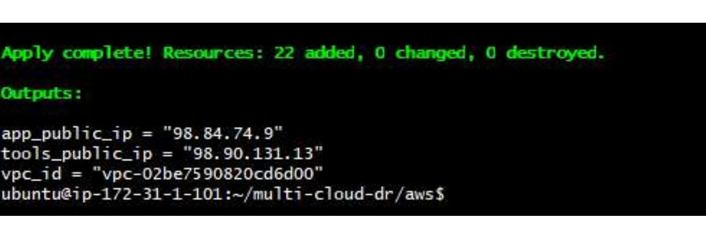

</td>
</tr>
<tr>
<td width="50%">

**Azure infrastructure provisioned**
<br/>`terraform apply` completes on the Azure module — 10 resources added, VM public IP assigned.

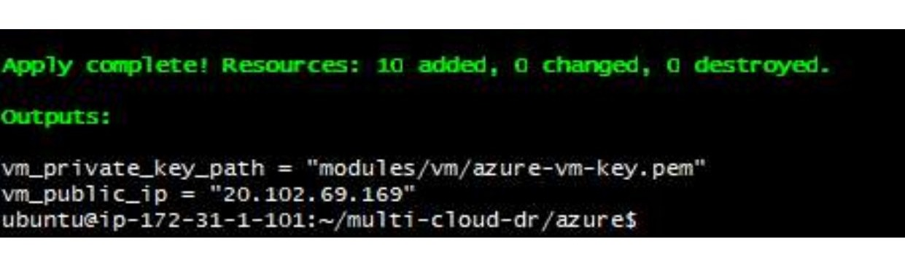

</td>
<td width="50%">

**Ansible — zero-failure run**
<br/>One playbook, two plays. `PLAY RECAP` shows `ok=6 changed=3 failed=0` on **both** hosts.

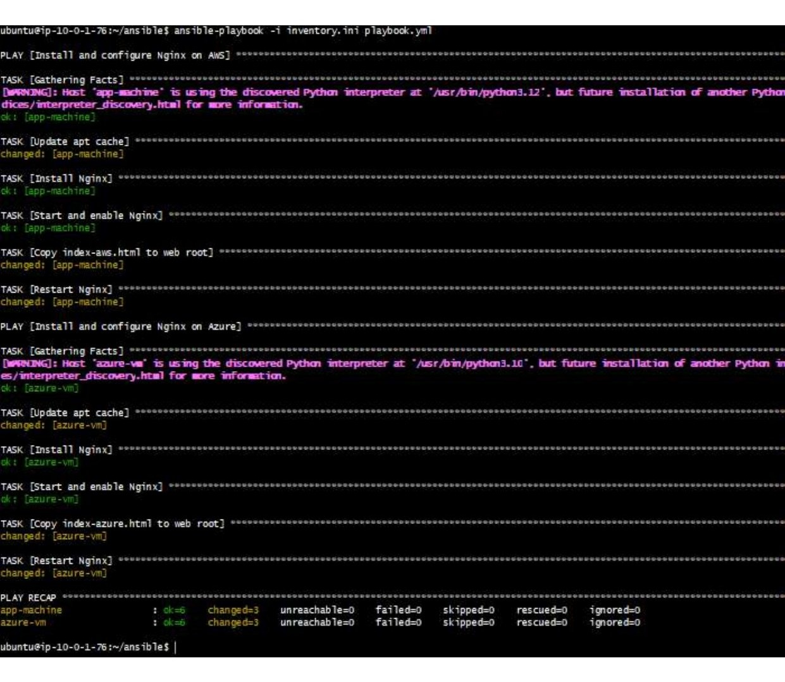

</td>
</tr>
<tr>
<td width="50%">

**Custom app live — AWS**
<br/>Nginx serving the deployed `index-aws.html` at the primary endpoint.

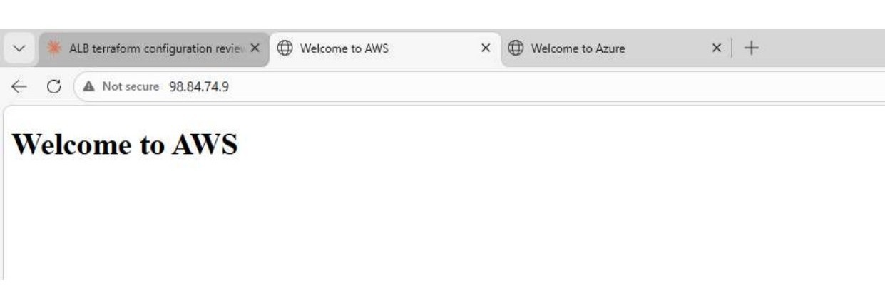

</td>
<td width="50%">

**Custom app live — Azure**
<br/>Identical deployment, different cloud — the DR endpoint serving `index-azure.html`.

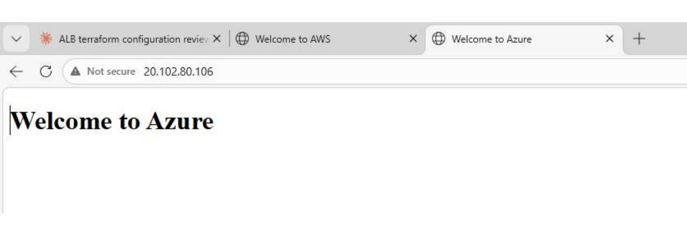

</td>
</tr>
<tr>
<td width="50%">

**Jenkins up and running**
<br/>`systemctl status jenkins` — active, PID confirmed, fully initialized.

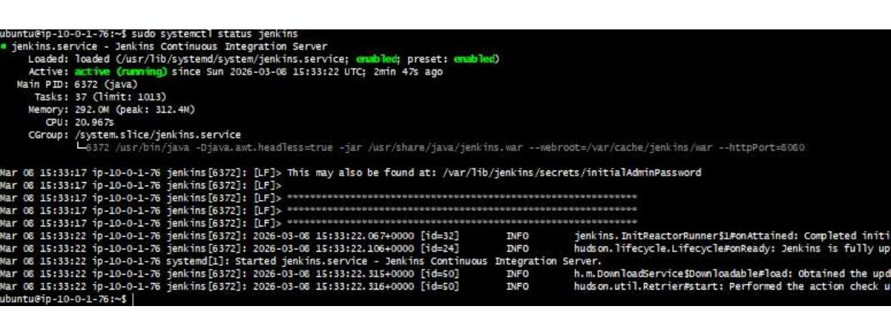

</td>
<td width="50%">

**Pipeline build — SUCCESS**
<br/>Console output for the `multi-cloud-deploy` job: SCP + SSH to both clouds, `Finished: SUCCESS`.

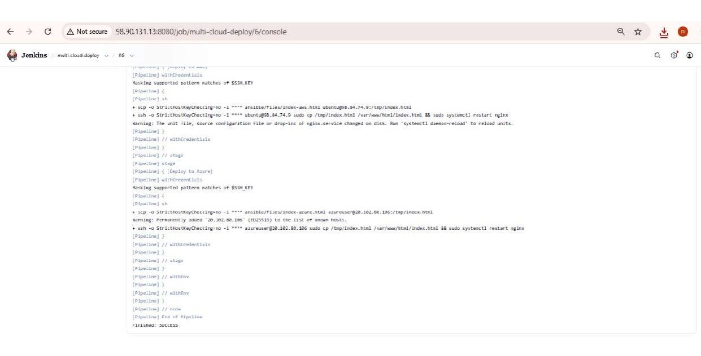

</td>
</tr>
<tr>
<td width="50%">

**Route 53 failover records**
<br/>`app.upgrad.com` — Primary (AWS, health-checked) and Secondary (Azure) A records, TTL 60.

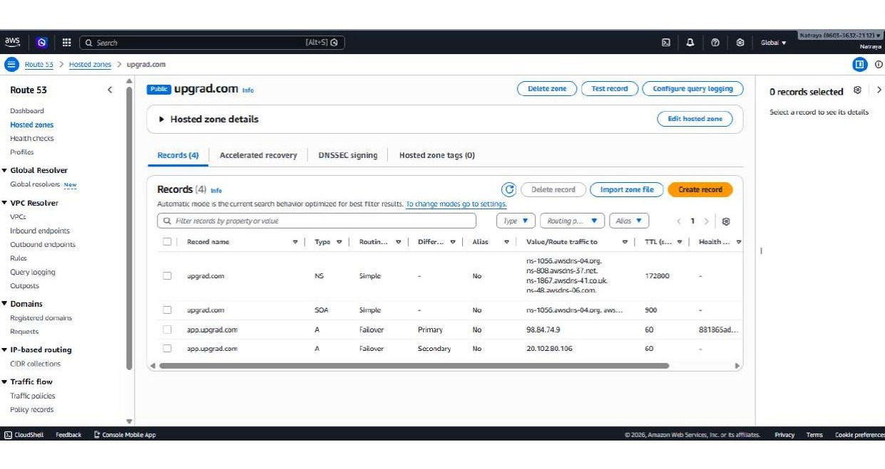

</td>
<td width="50%">

**Health check trips to Unhealthy**
<br/>AWS App-Machine stopped → `aws-health-check` immediately reports Unhealthy.

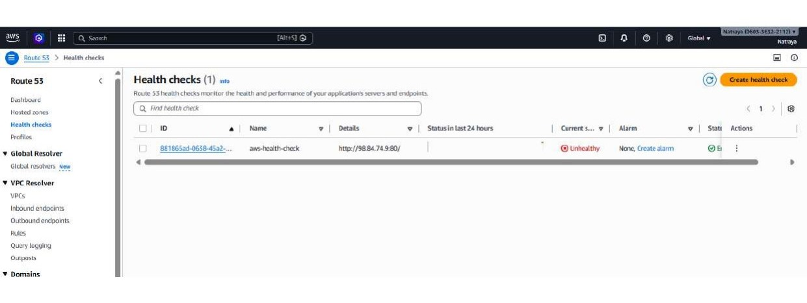

</td>
</tr>
<tr>
<td colspan="2">

**🎯 Failover confirmed — DNS now resolves to Azure**
<br/>Route 53's "Test record" tool returns `20.102.80.106` (the Azure VM) for `app.upgrad.com` — proof that failover happened automatically, with zero manual DNS changes.

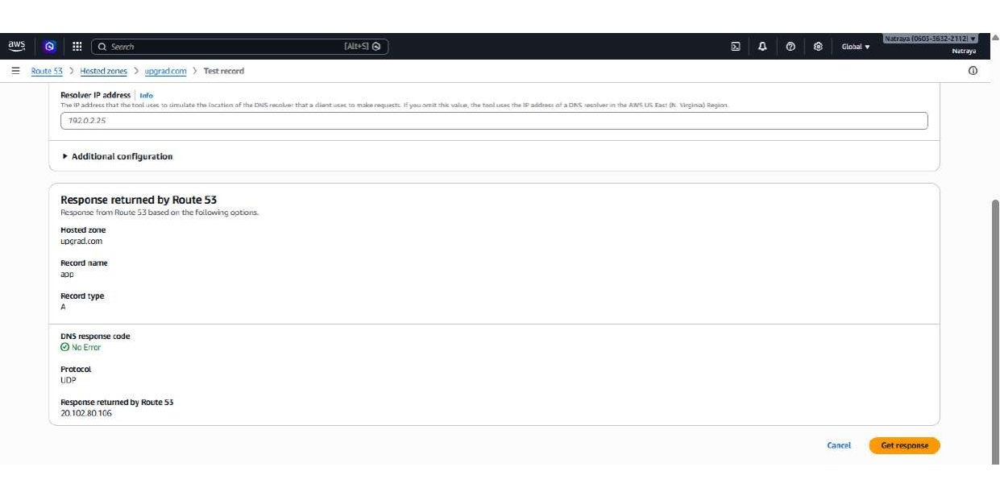

</td>
</tr>
</table>

---

## 💰 Infrastructure Cost Estimate

| Resource | Size | Hourly | Monthly (est.) |
|---|---|---|---|
| AWS EC2 — App-Machine | t3.micro | $0.0104 | ~$7.50 |
| AWS EC2 — Tools-Machine | t3.micro | $0.0104 | ~$7.50 |
| AWS NAT Gateway | per hour + data | $0.045 | ~$32.40 |
| AWS S3 (remote state) | < 1 MB | < $0.001 | < $0.10 |
| AWS DynamoDB (lock table) | on-demand | < $0.001 | < $0.10 |
| AWS Route 53 Hosted Zone | 1 zone | — | $0.50 |
| AWS Route 53 Health Check | 1 endpoint | — | $0.75 |
| Azure VM | Standard_B2ms | $0.0832 | ~$59.90 |
| Azure Static Public IP | Standard SKU | $0.004 | ~$2.88 |
| **Total (approx.)** | | **~$0.145/hr** | **~$111/month** |

> 💡 The NAT Gateway is the single biggest line item (~$32/month). Swapping it for a `t3.nano` NAT instance would bring that down to ~$3–4/month for a non-production setup.

---

## 🧹 Teardown

To avoid ongoing charges once you're done experimenting:

```bash
cd aws && terraform destroy
cd ../azure && terraform destroy
```

---

## 👤 Author

**Ariesh** — [GitHub: @ARIESH-git](https://github.com/ARIESH-git)

---

<div align="center">

*Built as a hands-on capstone in multi-cloud infrastructure automation and disaster recovery.*

</div>
